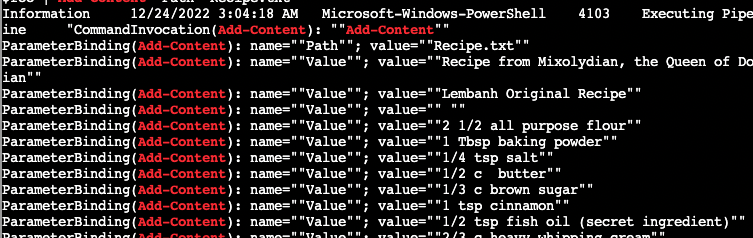

# Windows Events Logs

<https://linuxcommand.org/lc3_man_pages/grep1.html> 

1. What day did the attack happen?

`cat powershell.evtx.log | grep -P -i -o -w "\d{2}\/\d{2}\/\d{4}` | uniq -c`

Answer: `12/24/2022`

2. An attacker got a secret from a file. What was the original file's name?

`Recipe.txt`

3. The contents of the previous file were retrieved, changed, and stored to a variable by the attacker. Submit the full Powershell line that performed only these actions.

`cat powershell.evtx.log | grep "$foo = Get-Content"`

Answer: `$foo = Get-Content .\Recipe| % {$_ -replace 'honey', 'fish oil'} $foo | Add-Content -Path 'recipe_updated.txt'`
