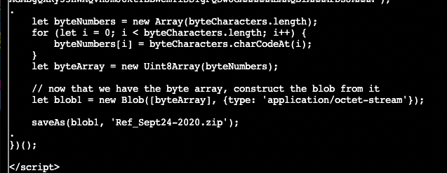

1. What type of objects are we able to export?

```console
tshark -Q -r pcap_challenge.pcap --export-objects http,.
```

`http`

2. What is the largest file we can export?

```console
ls -al
...
808777 'app(1).php'
754     app.php
```

`app.php`

3. What packet number starts that app.php file?

`tshark -r pcap_challenge.pcap -Y http`

4. What is the IP of the Apache server?

`192.185.57.242`

5. What file was downloaded on infected computer?

`tshark -q -nr pcap_challenge.pcap -z follow,http,ascii,0 -Y http | grep zip`



6. Attackers used bad TLS certificates in this traffic. Which countries were they registered to? Submit the names of the countries in alphabetical order separated by a commas (Ex: Norway, South Korea).

`tshark -r pcap_challenge.pcap -Y 'ssl.handshake.type == 11` -V | grep RDNSequence | grep countryName | uniq`

US, IE, IL, SS

United States, Ireland, Israel, South Sudan

Answer: `Ireland, Israel, South Sudan`

7. Is the host infected? (Yes/No)?

`Yes`